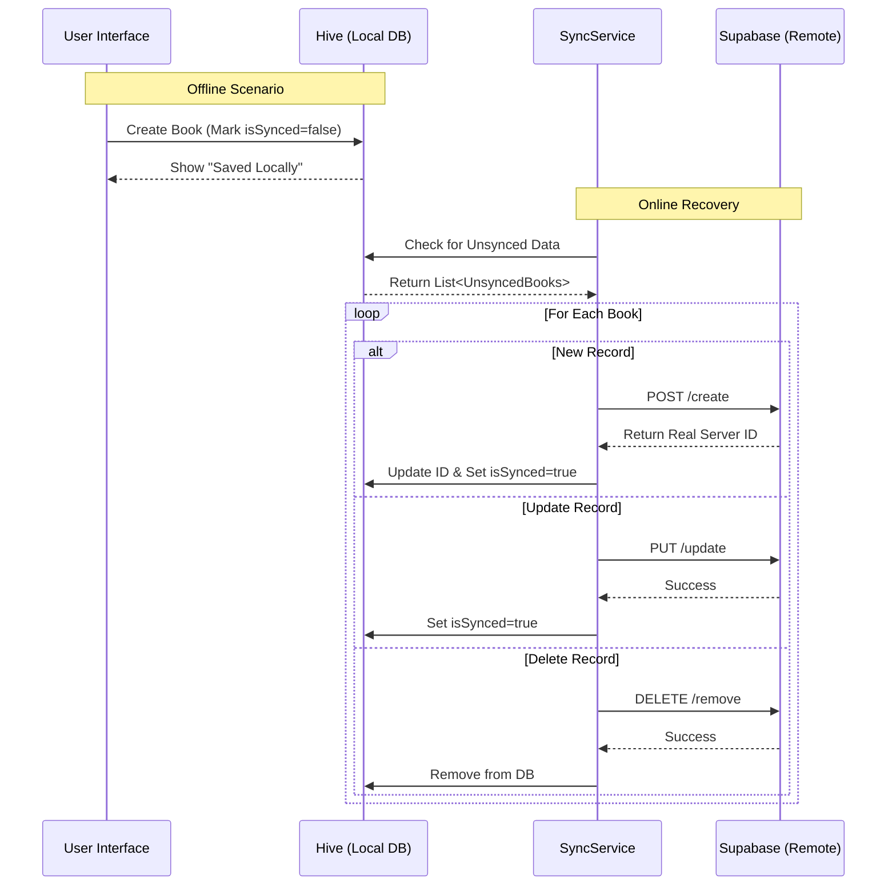

# 📘 Flutter CRUD Clean Architecture (Offline-First)


A professional Flutter application demonstrating **Clean Architecture** combined with a robust **Offline-First** data synchronization mechanism. This project showcases how to build resilient apps that work seamlessly without an internet connection and sync data intelligently when online.

---

## 🌟 Key Features

### 🔄 Advanced Offline/Online Synchronization
The core of this application is its ability to handle CRUD operations regardless of network connectivity.
-   **Local-First Approach:** All user actions (Create, Update, Delete) are immediately applied to the local database (Hive) for instant UI feedback.
-   **Smart Sync Service:** A dedicated `SyncService` runs in the background to synchronize local changes with the remote server (Supabase).
-   **Conflict Handling:** The system intelligently manages `isSynced` flags and temporary local IDs to ensure data consistency.

### 🏗️ Clean Architecture
The project is strictly structured into three layers to ensure separation of concerns and testability:
1.  **Presentation Layer:** Widgets, Pages, and BLoC/Cubits.
2.  **Domain Layer:** Entities, Usecases, and Repository Interfaces (Pure Dart, no external dependencies).
3.  **Data Layer:** Repositories implementations, Data Sources (Remote/Local), and Models.

---

## 🛠️ Tech Stack

-   **Framework:** [Flutter](https://flutter.dev/)
-   **State Management:** [Flutter Bloc](https://pub.dev/packages/flutter_bloc)
-   **Dependency Injection:** [GetIt](https://pub.dev/packages/get_it)
-   **Routing:** [GoRouter](https://pub.dev/packages/go_router)
-   **Local Database:** [Hive](https://pub.dev/packages/hive) (NoSQL)
-   **Remote Backend:** [Supabase](https://supabase.com/)
-   **Connectivity:** [Internet Connection Checker](https://pub.dev/packages/internet_connection_checker)
-   **UI/UX:** [Skeletonizer](https://pub.dev/packages/skeletonizer) (Loading effects), [CachedNetworkImage](https://pub.dev/packages/cached_network_image)

---

## 📂 Project Structure

```
lib/
├── core/                   # Core functionality (Error handling, Services, Utils)
│   ├── service/            # SyncService logic
│   └── errors/             # Custom Exceptions & Failures
├── features/               # Feature-based modules (e.g., Library/Books)
│   ├── data/               # Data Layer
│   │   ├── datasources/    # Remote (Supabase) & Local (Hive)
│   │   ├── models/         # JSON/Hive Adapters
│   │   └── repositories/   # Repository Implementation
│   ├── domain/             # Domain Layer
│   │   ├── entities/       # Core Business Objects
│   │   ├── repositories/   # Contract/Interfaces
│   │   └── usecases/       # CRUD Business Logic
│   └── presentation/       # Presentation Layer
│       ├── bloc/           # State Management
│       ├── pages/          # UI Screens
│       └── widgets/        # Reusable Components
└── main.dart               # Entry point & DI Setup
```

---

## 🔄 Data Synchronization Flow

The `SyncServiceImpl` manages the complex state of data integrity between your device and the server.



---

## 🚀 Getting Started

### Prerequisites
-   Flutter SDK (`^3.10.0`)
-   Dart SDK
-   Supabase Account

### Installation

1.  **Clone the repository**
    ```bash
    git clone https://github.com/AlthafKumara/Flutter_Bloc_CRUD.git
    cd CRUD_clean_bloc
    ```

2.  **Install Dependencies**
    ```bash
    flutter pub get
    ```

3.  **Environment Setup**
    Create a `.env` file in the root directory:
    ```env
    SUPABASE_URL=your_supabase_url
    SUPABASE_ANON_KEY=your_supabase_anon_key
    ```

4.  **Run the Generator** (for Hive & JsonSerialization)
    ```bash
    dart run build_runner build --delete-conflicting-outputs
    ```

5.  **Run the App**
    ```bash
    flutter run
    ```

---
